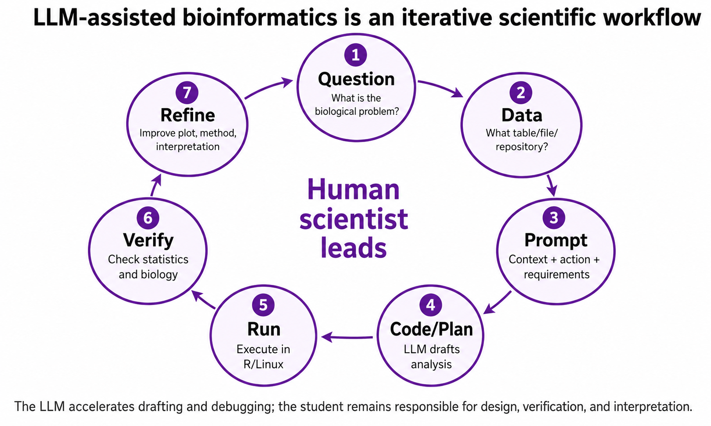
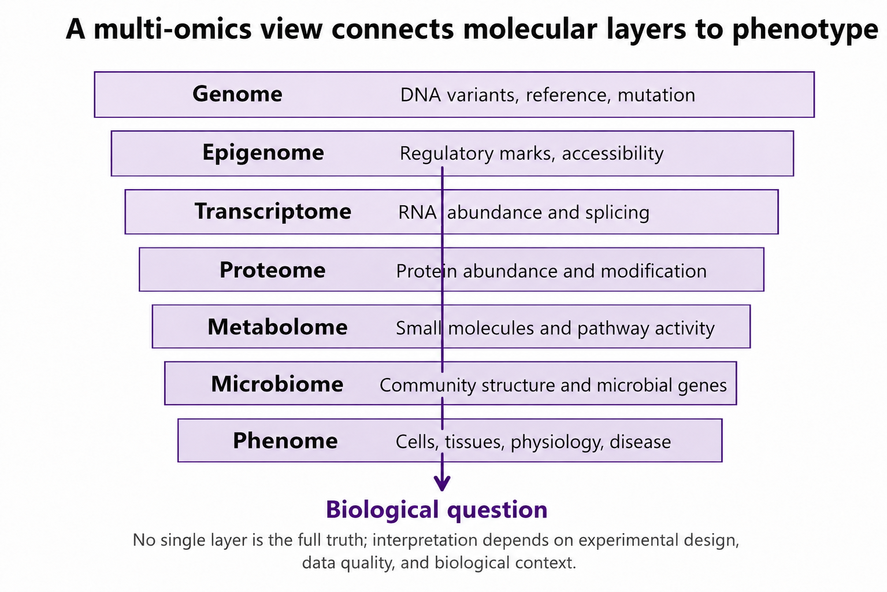
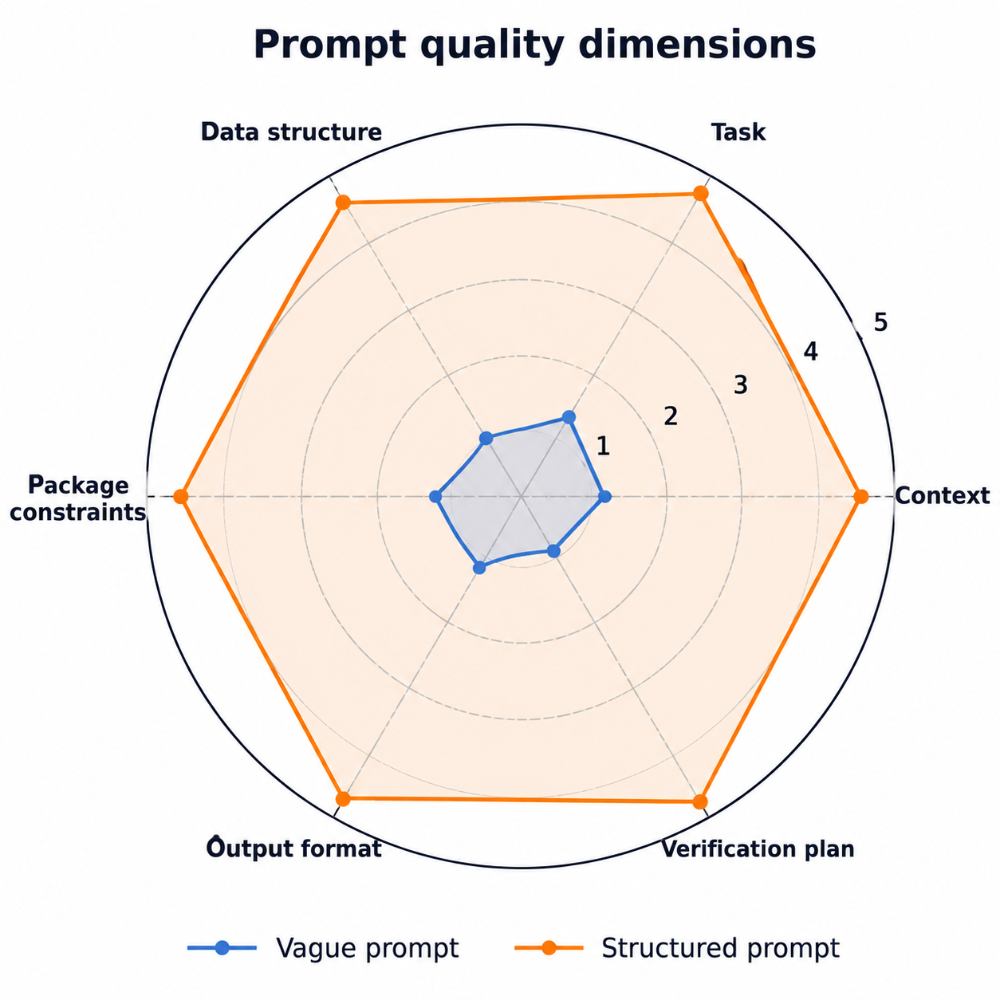

# Bioinformatics: From Multi-Omics Data to Discovery

## Course Overview

**Bioinformatics: From Multi-Omics Data to Discovery** is a hands-on, concept-driven undergraduate course introducing computational biology, multi-omics integration, and AI-assisted scientific workflows.

**Instructor:** Dr. Liwei Xie  
Faculty of Synthetic Biology  
Shenzhen University of Advanced Technology

---

## Core Vision

Modern biology integrates multiple layers:

- Genome
- Epigenome
- Transcriptome
- Proteome
- Metabolome
- Microbiome
- Phenome

---

## Iterative Scientific Workflow

---

## Multi-omics Integration

---

## Prompt Engineering Quality

---

## Key Principle

> No single layer is sufficient. Interpretation requires integration + verification.

---

## Skills Students Learn

- R / RStudio
- Multi-omics analysis
- RNA-seq & microbiome analytics
- AI-assisted coding
- Agent-based workflows
- Scientific reasoning

---

## AI in This Course

- LLM-assisted coding
- CLI tools integration
- Agent workflows
- Human-in-the-loop verification

---

## License

Teaching use only.
